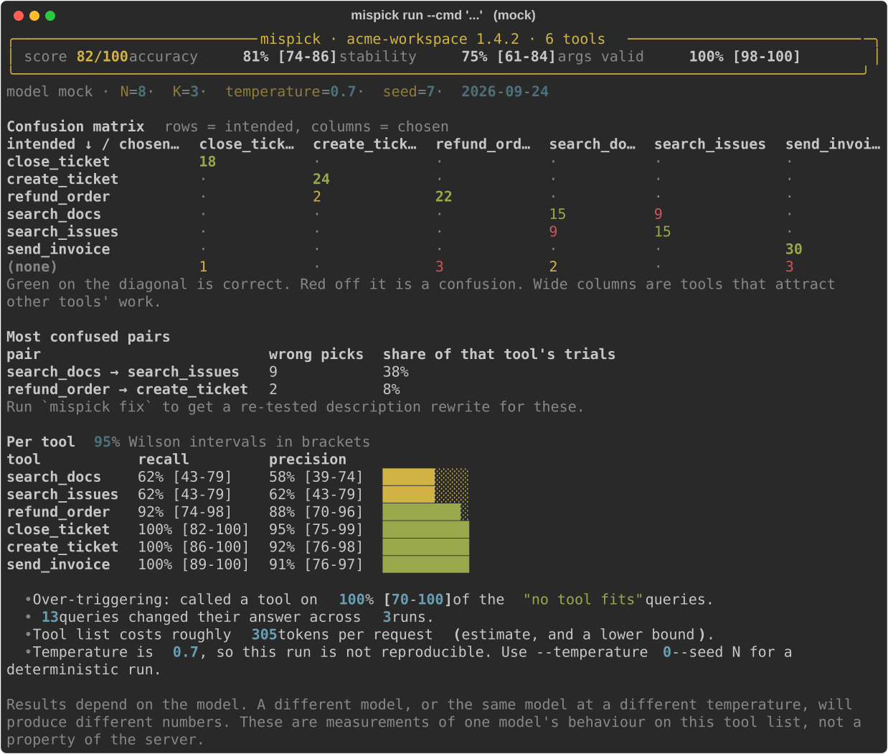

# mispick

**Find out which of your MCP tools the model mixes up — measured, not guessed.**

<p align="center">
  
</p>

```bash
uvx mispick run --cmd "python -m my_server"
```

Point it at any MCP server. It generates realistic user requests, asks a model to pick a tool for
each one, and shows you a **confusion matrix**: which tools get chosen for which intent. Then it
proposes description rewrites for the confused pairs and **re-runs to prove the fix helped**.

It never calls a tool. Only `initialize` and `tools/list`, so it is safe to point at a server that
deletes things.

---

## Why this rather than a static linter

`mcp-lint`, `mcpolish`, `oh-my-mcp`, `mcp-conform` and `mcp-cve-lint` check tool definitions
against rules, and they are good at it — run one. But a description can pass every rule and still
be indistinguishable from the tool next to it. Rule-based linters predict problems; this measures
them, by putting your tool list in front of a real model and counting what it picks. Two other
projects do measure selection — [`whichtool`](https://github.com/mattagame/whichtool) (local
models, but no rewrites, one server per run) and [`toolfit`](https://pypi.org/project/toolfit/)
(rewrites, but cloud-only, one server per run). Neither looks across servers. The full comparison,
with what each one actually does, is in [docs/research.md](docs/research.md).

## How it works

1. Connect to your server and read `tools/list` (never `tools/call`).
2. For each tool, generate N realistic requests — plus **hard negatives** written to sit as close
   as possible to its nearest neighbour, and some requests no tool should answer.
3. Ask the model to choose a tool for each request, K times, showing it the real tool definitions
   a client would send.
4. Score it: accuracy, per-tool precision and recall, a confusion matrix, argument validity,
   stability across the K runs — every rate with a Wilson 95% interval.
5. Propose rewrites for the worst pairs, re-run the same requests against them, and keep only the
   ones that measurably won.

## Install

> **Not on PyPI yet.** `mispick` has not been released, so the commands below do not work
> today. Until then, run it from a checkout:
>
> ```bash
> git clone https://github.com/msc35/mispick && cd mispick
> uv sync --all-extras
> uv run mispick --help
> ```

```bash
uvx mispick --help          # no install
uv tool install mispick     # or keep it
pip install mispick
```

The default backend is a local model through [Ollama](https://ollama.com), so it costs nothing and
needs no account:

```bash
ollama pull qwen3.5:4b
```

Cloud models are optional: `--model openai/gpt-4.1-mini` or
`--model anthropic/claude-haiku-4-5-20251001`, with the matching key in the environment.

## Use

```bash
# measure a local server, a remote one, or a captured snapshot
mispick run --cmd "python -m my_server"
mispick run --url https://example.com/mcp
mispick run --snapshot tools.json

# capture a snapshot so later runs are offline and reproducible
mispick snapshot --cmd "python -m my_server" -o tools.json

# every server in your config at once, and what they do to each other
mispick run --config ~/Library/Application\ Support/Claude/claude_desktop_config.json

# rewrites for the worst pairs, each one re-tested
mispick fix --cmd "python -m my_server" --patch fix.diff

# reports and CI
mispick run --snapshot tools.json --format html --out report.html --badge badge.svg
mispick run --snapshot tools.json --fail-under 80          # exit 1 below the threshold
mispick compare base.json head.json --max-drop 5           # exit 1 on a regression
```

Generated requests are cached in `.mispick/queries.yaml`. **Read that file and edit it** — it is
your test set, and it only regenerates for a tool whose name, description or schema changed.
Commit it.

### Proven fixes

`mispick fix` rewrites both descriptions in a confused pair, then re-runs the *same* requests
against the rewrite and reports before/after with an exact McNemar test — the trials are paired,
so an unpaired test would be the wrong one. Rewrites that fail are shown too.

That re-test is the whole point. Hasan et al. rewrote tool descriptions with an LLM across 231
tasks and found success rose by a median 5.85 points — but **regressed in 16.67% of cases**
([arXiv 2602.14878](https://arxiv.org/abs/2602.14878)). An unmeasured rewrite is a one-in-six
chance of making things worse. mispick also caps rewrite length, so a rewrite cannot win by
crowding out its neighbours, and it never edits your source — it prints a suggestion.

**Expect rejections, especially on a small local model.** In our own runs against
`ollama/qwen3.5:4b`, two of three proposed rewrites measurably made selection *worse* — one of them
took a tool from 78% to 58% accuracy, breaking 14 trials and fixing none, and it replicated when
re-run with three times the data. Its stated reasoning read perfectly sensibly. The third improved
by 10 points but over only two changed trials, which is not enough to call, so mispick reported it
as inconclusive rather than banking it. A 4B model is good enough to *find* confusion and often not
good enough to *write its way out of it*; fix mode is more productive with a larger model. Either
way the verdicts are the product — a run where nothing is accepted has told you something true.

### Across servers

Point `--config` at a whole `claude_desktop_config.json` and mispick loads every server at once,
because that is how a client sees them. It reports which bare tool names collide across servers
and — the part that matters — how often a request for one server's tool is answered by another
server's. On the two-server fixture, 17% of trials cross servers and `workspace:search_docs` falls
to 0% recall: every request for it is answered by `wiki:search_docs`. The MCP spec names this
problem and warns that `serverInfo.name` is not unique across servers, so mispick keys on your
config label instead.

### In CI

```yaml
- uses: actions/checkout@v4
- uses: msc35/mispick@v0.1.0
  with:
    snapshot: tools.json
    model: anthropic/claude-haiku-4-5-20251001
    fail-under: '80'
    compare-base: 'true'
  env:
    ANTHROPIC_API_KEY: ${{ secrets.ANTHROPIC_API_KEY }}
```

It posts the report as a sticky PR comment, and with `compare-base` the comment reads
`84 → 91 (▲7)` and names the confusions that appeared or disappeared. With no model key it skips
with an explanation instead of failing — a check that goes red over a missing secret is a check
people learn to ignore. See [examples/github-action](examples/github-action/).

## Benchmark

`benchmark/` runs the pipeline over servers from the official MCP registry that start without
credentials, and builds a static leaderboard. Snapshots are committed so results are reproducible,
only `initialize` and `tools/list` are ever sent, and the page lists the servers it could *not*
measure so the coverage is not overstated. See [benchmark/README.md](benchmark/README.md).

## Limitations

Read these before quoting a number.

- **Results depend on the model.** A score is one model's reading of one tool surface on one day,
  not a property of your server. Every report says so, and states the model, N, K and the date.
- **Small local models are noisy.** That is why every rate carries a Wilson 95% interval and why
  `--runs` exists. With K=3 the intervals are wide; read them, not the point estimate.
- **The requests are generated, so they are not your traffic.** They are a stand-in for it. Edit
  `.mispick/queries.yaml` to make them yours.
- **It measures one selection turn.** Not multi-step agent behaviour, not tool output quality, not
  recovery after a bad call. Arguments are checked against `inputSchema` and no further.
- **A low score can be correct.** Two tools may genuinely overlap. mispick tells you the model
  cannot separate them; whether they *should* be separable is your call.
- **`mispick fix` often accepts nothing**, and that is working as intended. See the note above.
- **Token counts are estimates**, and lower bounds — a real tokenizer and the provider's framing
  both add to them.
- **Reasoning models** spend heavily on hidden thinking. mispick turns thinking off by default for
  Ollama (measured: 89s → 2.2s per call on `qwen3.5:4b`, same answers); `--think` restores it.

## Development

```bash
uv sync
uv run pytest                         # offline; no model or network needed
uv run ruff check . && uv run mypy src
uv run mispick run --snapshot tests/fixtures/confusing_tools.json --model mock
```

`--model mock` is a deterministic offline backend. The test suite uses it, so `pytest` passes with
no Ollama, no keys and no network.

## License

MIT. See [LICENSE](LICENSE).
